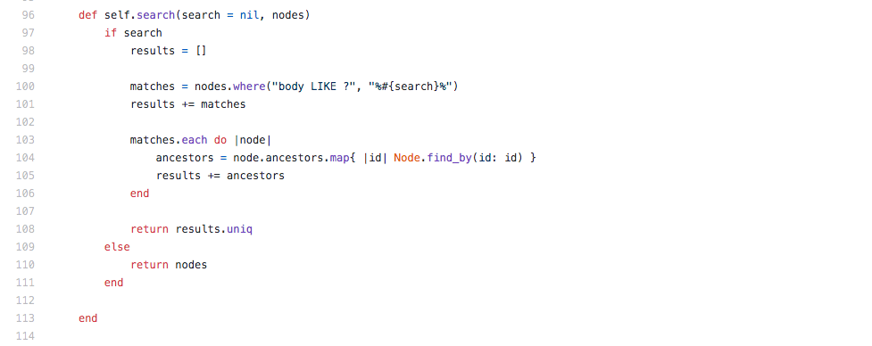
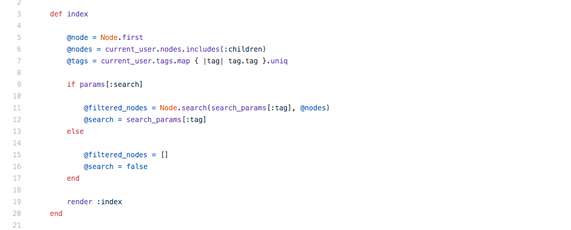

# README

[Unlimitlist](https://unlimitlist.herokuapp.com/#/) is a Workflowy clone, an app that aims to give organization to your ideas. 

## Why Unlimitlist? 

Unlimitlist provides the ability to make and edit lists, mark items as complete, and provides the ability to organize ideas via sublists. Any bulleted idea can house another list. 

## Key Features

* Unlimitlist has a persistent user authentication pattern that allows for signup and login functionality. 

* List items to be created from the interface (button) or with the keyboard, with a press of the enter key for seamless jotting. Items will be created with preservation of list order - with the next item being inserted after the item previously in focus. 

* Bullet items can be added as nested lists underneath other items. This means that lists can be flowing, and organized. 

* Users can perform a plaintext search, as well as save tags by putting a '#' in front of a word in a list item. 

## Technologies

* Unlimitlist is seeded and deployed on Heroku. 

* The project is built with a Ruby on Rails back-end, and PostgresSQL database and a React front end.

## Challenges 

* One of my biggest challenges was the search function. I wanted to create seamless a interface that utilized the same list component that I was using for listing all the items. 

* First I created a search function for the node model. I realized that in the search I would not only want to show the matched nodes but also the nodes that were above them in the tree. To do this I created logic to grab the search matches as the first part of the results. Then I iterated through each match, grabbed it's ancestors nodes (a helper function that recursively searches up the tree until the parent_id is nil), and added them to the results. Finally, I returned the result's unique values in case any nodes had ancestor nodes that overlapped. 

* Here is a snippet of my search function on the node model: 

* Next, in my index action on the nodes controller, since I was using a frontend route to differentiate when the user had searched, I checked the params to see if a search had been made. If the search was true, I created an instance variable, filtered nodes that would pass along to the frontend, all the results of the search. 

* In my component I was able to use my frontend routes, and the filtered nodes passed in to conditionally use the filtered nodes in the component, rather than all the nodes if the user was on the search route.

* Here is a snippet of my nodes controller index action: 

## Future Features

* Toggling hide/show of completed list items.
* Sharing lists with other users. 
* Drag and drop ordering of list items. 
* Exporting of lists in a printable format. 

